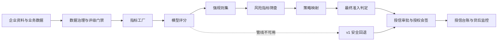
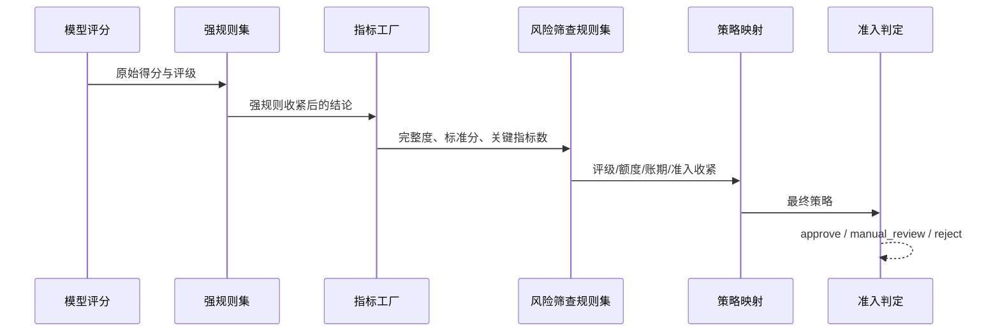

# 衡信客商信用风险与授信决策平台用户手册

> 适用版本：API `0.1.0`，规则中心数据库版本 `20260826_0059`
> 更新日期：2026-08-26
> 适用对象：客户经理、风控经理、模型管理员、授信审批人、运营人员、审计人员和平台管理员

## 1. 平台概览

平台用于统一管理客户与供应商的资料、信用评级、授信审批、模型治理、风险规则和贷后任务。核心决策能力分为三层：

1. **指标工厂**：定义数据口径、指标来源、派生表达式、评分分箱、模型选择和指标版本。
2. **规则中心**：定义强规则和风险筛查规则，组合规则集，并用决策管线编排评分、规则、筛查、策略和准入阶段。
3. **模型与决策治理**：管理模型变更、验证、审核发布、回滚、监控和审计证据。

平台采用双轨运行机制：配置了有效管线时优先执行规则中心；管线不存在、未激活或依赖不完整时，自动回退现有 v1 评分路径。回退不会留下半条执行结果。



### 1.1 当前工作台

React 业务前端提供八个工作台：

| 工作台 | 主要用途 | 典型角色 |
|---|---|---|
| 风险总览 | 查看组合风险、审批态势和授信敞口 | 风控、审批、管理人员 |
| 客商中心 | 查看客户/供应商画像、原始资料、治理数据和组合评级 | 客户经理、风控 |
| 授信审批 | 办理八阶段授信流程、授权会签和最终决策 | 客户经理、风控、审批人 |
| 模型实验室 | 查看评分链、指标、强规则、影响模拟和模型治理 | 模型管理员、风控、审核人 |
| 决策规则 | 配置规则、规则集和决策管线，执行规则测试与管线模拟 | 模型管理员、风控、审计 |
| 资料中心 | 上传、关联、预检、核验、退补和版本追踪 | 企业客户、客户经理、风控 |
| 运营监控 | 处理个人待办、团队任务、SLA 扫描、通知和催办 | 运营、风控、审计 |
| 贷后管理 | 管理额度、用信、复评、预警、续授信和控制条件 | 客户经理、风控、审批人 |

“决策规则”工作台按规则、规则集和决策管线分层展示资产。具备 `models:view` 的角色可以查看、测试和模拟；具备 `models:manage` 的模型管理员可以保存和提交治理草稿；具备 `models:review` 的风控经理或平台管理员可以独立复核、定时生效和运行到期扫描。创建人不能复核自己的变更。

### 1.2 角色与权限

关键权限遵循最小授权原则。演示环境可在页面右上角切换身份；生产环境应接入 OIDC，禁止使用开发令牌。

| 角色 | 主要职责 |
|---|---|
| 企业客户 | 上传和查看本企业资料、处理补件、查看本人申请与通知 |
| 客户经理 | 建立客商、发起审批、导入治理数据、办理业务资料和用信交易 |
| 风控经理 | 核验资料、运行评分、复核数据冲突、处理风险和模型审核 |
| 模型管理员 | 管理模型、配置候选版本、运行影响评估、管理规则中心发布 |
| 授信审批人 | 形成额度建议、执行授权会签、审核最终策略和控制条件延期 |
| 运营人员 | 监控 SLA、处理任务归属、催办、扫描异常和运行台账 |
| 审计人员 | 只读查看模型、决策、任务、授信和哈希审计证据 |
| 平台管理员 | 平台级管理和应急处置；不应代替正常四眼审核流程 |

## 2. 登录与启动

### 2.1 本地启动

在项目目录启动 API：

```bash
../.venv/bin/uvicorn backend.main:app --reload --port 8000
```

在另一个终端启动 React 前端：

```bash
cd frontend
npm install
npm run dev
```

常用地址：

- 业务前端：`http://127.0.0.1:5173/`
- OpenAPI：`http://127.0.0.1:8000/docs`
- 健康检查：`http://127.0.0.1:8000/api/v1/health`

### 2.2 演示身份

开发模式可使用 `Bearer dev-*` 令牌，例如模型管理员为 `dev-model-admin`、风控经理为 `dev-risk`、审计人员为 `dev-auditor`。开发令牌只能用于本地演示，生产环境必须配置 OIDC issuer、audience 和 JWKS URL。

## 3. 客商管理

### 3.1 查看客商

进入“客商中心”，按客户/供应商类型、模型和风险状态筛选。选择企业后可查看：

- 企业基本信息和当前评级；
- 申请额度、当前额度和风险标签；
- 原始企业档案及材料来源；
- 治理后的字段、冲突、时效性和评级准备度；
- 历史评级及组合批量评级结果。

### 3.2 导入企业数据

具备 `data_governance:import` 权限的人员可导入内部 ERP、工商、审计财务、外部风险、信用报告或企业提交数据。每批数据必须提供：

- 唯一导入键；
- 客商编号和数据来源；
- 数据时点；
- 证据引用；
- 字段载荷及可选的逐字段证据。

同一字段存在多个来源时，系统按来源优先级和时效性形成有效值。存在冲突、超期或缺失必需字段时，评级门禁会阻止自动决策或要求人工复核。

### 3.3 处理字段冲突

1. 打开客商的“数据治理”区域。
2. 查看冲突字段的各来源值、时点和证据。
3. 选择拟采用的字段记录并填写裁决原因。
4. 由具备复核权限且不同于创建人的人员审核。
5. 审核通过后，新有效值进入后续模型输入；原始记录继续保留。

不得直接修改数据库中的有效字段来绕过裁决流程。

## 4. 信用评级

### 4.1 单户评级

在客商中心或审批“形成评分”阶段选择模型并运行评分。系统依次完成：

1. 检查资料和治理数据是否满足评级门禁；
2. 冻结模型版本和输入快照；
3. 计算模型维度或子模型得分；
4. 执行强规则和企业风险筛查；
5. 形成评级、准入策略、额度、账期和监控频率；
6. 保存输入哈希、结果哈希和计算轨迹。

### 4.2 模型类型

| 模型 | 适用场景 | 主要输出 |
|---|---|---|
| 通用客商信用模型 | 一般客户与供应商 | 四维度得分、评级、额度和账期 |
| 材料增强型工商企业模型 | 财务及工商材料较完整的企业 | 分层子模型、业务财务矩阵、完整度和额度约束 |
| 科创企业基本评价模型 | 科创企业 | 基础分、加减分、额度分档和科创支撑项 |
| 行业派生模板 | 医药、制造、建筑、物流等 | 继承通用能力并覆盖行业配置 |

### 4.3 结果解读

评级结果应连同以下证据阅读，不能只看等级：

- `raw_rating`：规则和收紧前的模型评级；
- `rating`：最终评级；
- `dimension_scores`：维度或子模型得分；
- `strong_rule_hits`：命中的强规则及动作；
- `enterprise_risk_screening`：指标池完整度、标准分和逐指标结果；
- `risk_screening_policy`：风险筛查命中及收紧前后对比；
- `decision_pipeline_trace`：实际执行的管线版本和阶段证据；
- `review_required`：是否必须人工复核。

当管线依赖不足时，结果不会包含 `decision_pipeline_trace`，表示本次安全回退 v1。回退是兼容机制，不等于配置已完整上线。

### 4.4 组合批量评级

客商中心支持按客商范围和模型创建批量评级。批次会冻结模型快照，逐户保存结果或跳过原因，并汇总：

- 评级、风险分层和准入分布；
- 待复核、限制准入和禁入队列；
- 建议额度；
- 风险筛查收紧数量；
- 模型版本和结果哈希。

单批最多处理平台配置允许的样本量。批次结果用于风险排查，不自动替代授信审批。

## 5. 指标工厂

### 5.1 指标结构

指标分为三层：

- **原子指标**：通过 `field_path` 直接读取客商字段；
- **派生指标**：通过受限表达式计算，必须声明依赖；
- **复合指标**：组合多个原子或派生指标形成结果。

每个指标包含编码、名称、分类、数据类型、字段/表达式、依赖、评分分箱、最大分、默认权重、来源和版本信息。

### 5.2 表达式安全边界

表达式引擎仅允许数字、字符串、布尔、列表/元组、比较、布尔运算、基础算术和白名单函数。禁止属性访问、导入、下标、lambda 和任意函数调用。表达式失败时指标安全降级为待补充，不执行原始字符串代码。

可用函数包括 `abs`、`round`、`min`、`max`、`clamp`、`sum`、`len` 和 `contains`。

### 5.3 模型选择指标

指标发布只代表“可用”，不代表自动加入所有模型：

- 模型配置了 `indicator_selection` 时，仅计算明确选择且已激活的指标；
- 模型未显式选择但具有已知 `scorecard_type` 时，使用该模型的默认组合；
- 直接进行指标池验收且没有模型语境时，才允许计算全部激活指标；
- 任一必需定义缺失时，风险筛查回退 v1，不使用不完整的 v2 结果。

### 5.4 当前操作边界

模型实验室可查看和调整模型级指标选择、权重及风险贷策。当前版本尚未提供独立的指标定义 CRUD API 页面；指标定义发布通过受控种子脚本和 `IndicatorDefinitionRepository` 完成。生产环境不得直接编辑 `indicator_definitions` 表。

科创健康分占位定义保持未激活，只有公式、依赖、来源和分箱完成治理后才能发布。

## 6. 规则中心

### 6.1 规则定义

一条规则包含：

- 唯一编码和名称；
- 类型：`strong_rule`、`risk_screening` 或 `admission`；
- 条件列表及 `all/any` 关系；
- 动作列表；
- 优先级、启用状态、版本和发布状态。

支持的主要动作：

| 动作 | 用途 |
|---|---|
| `rating_override` | 将评级收紧到指定等级 |
| `access_strategy` | 收紧准入策略 |
| `risk_segment_override` | 收紧风险分层 |
| `limit_multiplier_cap` | 设置额度比例上限 |
| `payment_term_days_cap` | 设置账期上限 |
| `review_required` | 强制人工复核 |
| `score_adjustment` | 仅允许负向分数调整 |
| `severity` | 设置风险严重程度 |

规则动作采用“只收紧、不放宽”原则。多条额度上限取最严格比例后应用一次，不连续相乘。

### 6.2 规则集

规则集显式引用规则编码，可选择：

- `first_hit`：只应用第一条命中规则；
- `all_hits`：应用全部命中规则；
- `most_restrictive`：应用全部命中规则并合并为最严格结论。

规则集发布前会检查引用非空、不重复，并确认每条规则已发布且激活。悬空引用不会进入生效状态。

### 6.3 决策管线

管线必须以 `scoring` 开始，支持五类阶段：

1. `scoring`：执行模型评分；
2. `strong_rules`：执行强规则集；
3. `risk_screening`：计算指标工厂结果并执行筛查规则集；
4. `strategy_mapping`：把评级映射为额度、账期、准入和监控频率；
5. `admission`：形成 `approve`、`manual_review` 或 `reject`。

管线发布前会校验阶段类型、顺序、重复引用和规则集依赖。任一运行依赖不完整时整条管线返回空结果，由评分入口回退 v1。

### 6.4 通过前端操作

进入左侧“决策规则”工作台后，按以下顺序配置：

1. 先填写变更原因，再在“规则”页配置编码、类型、条件关系、表达式、比较方式、动作和优先级，选择“保存治理草稿”。
2. 在页面下方治理队列中编辑草稿并提交复核。提交后配置仍不会进入运行环境。
3. 切换到具备复核权限且不是草稿创建人的身份，填写复核意见，选择立即发布、安排未来生效时间或驳回。
4. 在“规则集”页选择已发布规则或有效候选规则和执行策略；在“决策管线”页从固定评分阶段开始编排，并为规则阶段关联已发布或有效候选规则集。候选依赖必须与引用方进入同一发布包。
5. 选择已发布规则可执行单规则测试；选择已发布管线可选取测试企业和评分模型执行全链路模拟。
6. 选择已有资产可查看版本历史。恢复历史版本只会创建新的治理草稿，仍需提交和独立复核，不会直接覆盖运行版本。

资产列表支持名称和编码检索。治理队列展示基础版本、候选版本、创建人、复核人、计划生效时间和行版本。只读角色的配置控件禁用，但规则测试与管线模拟仍可使用。

### 6.5 统一发布包

需要同时切换规则、规则集和管线时，在页面底部“统一发布包”区域操作：

1. 勾选状态为 `draft` 的候选变更，成员可跨规则、规则集和管线三个页签。
2. 填写发布包名称和变更原因，先选择“分析影响”。页面展示新建/更新数量、包内/运行依赖、下游规则集与管线及门禁错误。
3. 门禁通过后创建发布包。系统锁定成员候选版本，成员状态变为 `package_draft`，不能再单独提交或加入其他发布包。
4. 对涉及决策管线的发布包选择“配置回放”，指定模型、受影响管线、样本量和差异阈值，再运行历史样本回放。页面展示规则命中率、评分变化、评级/准入迁移矩阵、收紧/放宽数量和证据哈希。
5. 只有当前配置指纹对应的最新回放门禁通过后才能提交复核。成员随后进入 `package_pending_review`，另一位具备 `models:review` 权限的人员填写意见并批准或驳回。
6. 批准时系统固定按规则、规则集、管线顺序在一个数据库事务中发布；任一成员失败时整包回滚。驳回时成员恢复为普通草稿。

回放必须选择不可变数据集快照，默认样本上限 100、最低样本数 10、最大准入变化率 50%、最大执行失败率 0%。少于 30 户会标记为小样本证据。基线优先执行同编码运行管线；新管线没有运行基线时使用模型 v1 结果。提交和批准前都会重新检查配置指纹、数据集快照哈希、回放证据哈希、回放门禁、运行基线和依赖快照；环境、候选配置或快照内容变化时必须重新回放或重新创建发布包。

### 6.6 历史回放数据集

在“统一发布包”顶部选择“管理数据资产”：

1. 创建逻辑数据集，填写唯一编码、名称和业务口径说明。
2. 选择“导入快照”，指定数据源、模式版本、时间截面、数据分级和证据引用。
3. 原始字段与评分标准字段不一致时，在“字段映射 JSON”中按 `标准字段: 原始字段` 配置映射；已经符合平台客商结构时使用空对象 `{}`。
4. 在“样本记录 JSON”中提交对象数组，可选指定标签字段与观察时间字段。
5. 系统校验 `id/name/counterparty_type`、样本 ID 唯一性、敏感字段、观察时间不晚于快照截面，并生成字段覆盖率、标签覆盖率、标签分布和脱敏报告。
6. 每次成功导入生成递增版本和 SHA-256 内容哈希。快照没有修改或删除接口；修正数据必须导入新版本。

平台会阻断常见个人敏感字段和时间穿越样本。数据分级只能选择“已脱敏”或“合成数据”，但该声明不能代替机构的数据授权、脱敏评审和隐私合规流程。

### 6.7 Champion / Challenger 双模型验证

在历史回放数据集下方选择“配置并行验证”：

1. 选择同一个不可变快照，并分别选择 Champion 与 Challenger 模型、已发布决策管线。系统固化两侧模型版本、管线版本和快照哈希。
2. 配置分群字段、实际正类标签和预测正类准入状态。多个值使用英文逗号分隔，例如正类标签 `bad,default,reject`，预测正类准入 `reject,禁入`。
3. 运行后查看两侧评分均值/中位数/范围、失败率、评分分箱、评级分布、准入分布、平均分差、评级/准入变化率和 PSI。
4. 页面按分群字段展示样本数、两侧平均分、平均差以及评级/准入变化率，用于识别局部客群漂移。
5. 快照存在标签时，系统基于有效标签样本计算两侧 KS 与 TP/FP/TN/FN 混淆矩阵；没有有效标签时，证据级别明确降为“非监督稳定性证据”，KS 和混淆矩阵留空，不能作为有监督区分度结论。
6. 每次运行都会写入独立比较资产和 SHA-256 证据哈希。运行不修改快照、模型、管线或业务决策；快照内容哈希复算不一致时直接阻断。

PSI 衡量两侧评分分布差异，不等同于模型优劣结论。KS 与混淆矩阵还受标签窗口、正类定义、样本代表性和阈值口径影响，正式验证应由模型风险管理人员复核。

### 6.8 通过 API 操作

查看规则需要 `models:view`，创建和提交草稿需要 `models:manage`，复核与生效扫描需要 `models:review`。

创建并发布规则：

```bash
curl -X POST http://127.0.0.1:8000/api/v1/rule-center/rules \
  -H 'Authorization: Bearer dev-model-admin' \
  -H 'Content-Type: application/json' \
  -d '{
    "code": "SR-LIMIT-001",
    "name": "高额申请人工复核",
    "rule_type": "strong_rule",
    "category": "credit_risk",
    "conditions_json": [{
      "expression": "requested_limit > 1000000",
      "operator": "bool",
      "label": "申请额度超过100万元"
    }],
    "condition_relation": "all",
    "actions_json": [
      {"type": "access_strategy", "value": "人工复核"},
      {"type": "review_required", "value": true}
    ],
    "priority": 10
  }'
```

试跑规则不会产生发布版本：

```bash
curl -X POST http://127.0.0.1:8000/api/v1/rule-center/rules/SR-LIMIT-001/test \
  -H 'Authorization: Bearer dev-risk' \
  -H 'Content-Type: application/json' \
  -d '{"context":{"requested_limit":1500000}}'
```

创建规则集后才能创建引用它的管线。内置阶段不要发送空的 `rule_set_code`；只有需要规则集的阶段才填写该字段。

治理前端使用 `/rule-center/governance/changes` 创建、更新、提交和复核候选配置；`/governance/history` 查询版本历史，`/governance/restore-drafts` 创建恢复草稿，`/governance/activation-scan` 执行到期生效。

### 6.6 发布与治理边界

规则中心前端默认使用四眼治理。候选状态包括 `draft`、`pending_review`、`rejected`、`scheduled`、`published` 和 `activation_failed`。批准发布时系统在同一事务中：

1. 停用同编码旧版本；
2. 激活新版本；
3. 写入隔离的治理变更记录；
4. 写入包含配置哈希的审计事件。

为兼容种子脚本和旧调用方，`POST /rules`、`POST /rule-sets` 和 `POST /pipelines` 仍保留直接发布语义，但治理工作台不会调用这些接口。生产集成应优先使用治理 API，并限制直接发布接口的调用主体。未来生效的候选在基线版本变化时不会强行覆盖，而会进入 `activation_failed`，要求基于最新版本重新创建草稿。同一资产最多存在一个 `scheduled` 候选。

截至本手册更新时，真实 `data/platform.db` 的规则、规则集和管线表为空，尚未执行默认规则中心种子。三个模板虽然配置了默认管线编码，但会安全回退 v1。

## 7. 模型治理

### 7.1 模型变更流程

模型管理员在模型实验室创建候选变更，配置权重、阈值、强规则、策略映射、指标选择和风险筛查策略。标准流程为：

```text
创建草稿 -> 编辑配置 -> 验证与影响评估 -> 提交审核 -> 独立审核 -> 发布
```

创建人不能审核自己的候选版本。样本覆盖、计算完整性、标签量或验证门槛未满足时，候选版本不能提交发布。

### 7.2 影响评估

发布前应检查：

- 评级迁移和高风险召回变化；
- 额度、账期和准入策略变化；
- 强规则命中变化；
- 指标数据完整度和风险筛查变化；
- 组合样本覆盖和计算失败样本；
- 变更是否放宽风险结论。

### 7.3 发布与回滚

审核通过后形成激活 release。回滚只能选择已有 release，并填写原因。发布和回滚均保留模型配置哈希、操作者、时间和审计记录。在途审批冻结模型和输入版本，不因后续发布而改变。

### 7.4 模型监控

模型治理支持真实结果导入、独立核验、周期监控、问题整改和复验。正式回溯需要满足最低样本、时间跨度和事件/非事件数量；未达到门槛时代理数据只能作为演示证据。

## 8. 授信审批

### 8.1 八阶段流程

| 阶段 | 主办角色 | 完成条件 |
|---|---|---|
| 客户注册 | 客户经理 | 主体信息完整 |
| 上传资料 | 企业客户/客户经理 | 资料上传并关联申请 |
| 补充资料 | 企业客户/客户经理 | 指定缺口和退补任务关闭 |
| 发起审批 | 客户经理 | 业务类型、额度和账期完整 |
| 选择模型 | 风控/模型管理员 | 模型、数据和版本门禁通过 |
| 形成评分 | 风控/模型管理员 | 可信评分及哈希保存 |
| 额度与授信期 | 授信审批人 | 建议额度、账期和授权层级形成 |
| 最终策略 | 有权审批人 | 会签完成并保存最终决定 |

页面会显示当前责任角色、完成条件和阻断原因。已完成、拒绝或撤回的申请不会继续进入待办。

### 8.2 资料四眼核验

上传人不能完成自己的独立核验。核验按完整性、主体匹配、有效期、关键页和可读性逐项检查。要求补充时生成退补任务，替换版本保留 V1/V2/V3 链路。只有核验通过的资料才能推动审批。

### 8.3 授权会签

最终策略根据额度和风险匹配标准、加强或委员会授权层级。会签按席位顺序进行，同一人员不能占用多个独立席位。偏离模型建议必须登记原因，风险放宽还必须给出补偿措施。

## 9. 风险筛查与准入判定

风险筛查位于模型评分之后，只允许保持或收紧模型结论。



重点字段：

- `completeness`：已取得指标占比；
- `normalized_score`：指标池归一化分；
- `critical_indicator_count`：已取得且处于关键低分区间的指标数；
- `missing_count`：缺失指标数。

筛查结果不能提高评级、增加额度、延长账期、放宽准入或取消已有人工复核要求。

## 10. 贷后与运营

### 10.1 贷后管理

授信审批完成后形成授信台账。具备权限的人员可：

- 登记额度占用和归还；
- 发起复评和续授信；
- 登记风险事件；
- 处理高使用率、到期、复评和风险预警；
- 创建冻结、降额或关闭等控制动作；
- 完成续授信控制条件或申请延期。

风险动作必须填写业务依据。存在未归还余额时不能关闭授信；续授信申请额度不能低于当前已用余额。

### 10.2 运营监控

运营中心统一展示个人待办、团队任务、SLA 风险、补件任务和通知。任务认领使用限时租约，过期后自动释放。人工催办有频率限制，延期有次数和总时长限制。

SLA 扫描使用全局租约防止多实例重复执行，并记录运行键、心跳、处理数量、失败和恢复证据。异常释放或重试必须填写原因。

## 11. 核心 API 参考

所有业务 API 使用前缀 `/api/v1`，并要求 Bearer token。完整请求和响应模型以 `/docs` 为准。

| 业务域 | 关键端点 | 权限示例 |
|---|---|---|
| 身份 | `GET /auth/me` | 已登录 |
| 客商 | `GET /counterparties` | `counterparties:view` |
| 评级 | `POST /ratings/run`、`POST /ratings/trace` | `ratings:run` |
| 批量评级 | `POST /ratings/batches`、`GET /ratings/batches/{id}` | `ratings:run/view` |
| 模型 | `GET /models`、`POST /models/impact` | `models:view`、`ratings:run` |
| 模型治理 | `/model-governance/changes`、`/releases`、`/validation` | `models:manage/review/view` |
| 指标池 | `GET /indicator-pool` | `models:view` |
| 指标观察值 | `/indicator-observations` | `indicator_data:view/manage/review` |
| 规则 | `/rule-center/rules` | `models:view/manage` |
| 规则集 | `/rule-center/rule-sets` | `models:view/manage` |
| 管线 | `/rule-center/pipelines` | `models:view/manage` |
| 审批 | `/approval-cases` | `approvals:create/view/act` |
| 资料 | `/documents` | `documents:upload/view/review` |
| 数据治理 | `/data-governance` | `data_governance:*` |
| 授信台账 | `/credit-facilities` | `facilities:*` |
| 信用报告 | `/credit-reports` | `reports:view/generate` |
| 运营任务 | `/operations` | `operations:view`、`tasks:manage`、`sla:scan` |
| 审计 | `/audit` | `audit:view` |

常见 HTTP 状态：

| 状态 | 含义 | 处理方式 |
|---|---|---|
| `200/201` | 查询或创建成功 | 检查响应中的版本和状态 |
| `401` | 缺少或无效令牌 | 重新登录或更新 Bearer token |
| `403` | 当前角色无权限 | 切换有权角色，不要绕过权限 |
| `404` | 资源不存在 | 核对编码、ID 和激活状态 |
| `409` | 并发或版本冲突 | 刷新数据后重新提交 |
| `422` | 输入或依赖校验失败 | 根据 `detail` 修正字段、阶段或引用 |

## 12. 审计与数据安全

模型、指标、规则、规则集、管线、审批、资料和关键运营动作均保留操作者和时间。治理发布事件使用 SHA-256 内容哈希并串联前序哈希，支持发现内容篡改和链路断裂。

操作要求：

- 不直接修改生产数据库中的治理表；
- 不共享管理员或审批人账号；
- 不用开发令牌连接生产环境；
- 不删除历史版本、审计事件或证据文件；
- 不在缺少证据时人工填充“正常”数据；
- 发生并发冲突时刷新后重做，不覆盖其他人员变更；
- 对模型放宽、授信偏差和异常释放填写真实业务依据。

## 13. 常见问题

### 13.1 模板已绑定管线，为什么结果仍走 v1？

管线编码存在不代表依赖完整。检查管线是否已发布激活、规则集和规则是否齐备、指标工厂是否包含模型所需指标。任一条件不满足都会安全回退。

### 13.2 为什么通过旧 API 创建规则后直接是 published？

`POST /rules`、`POST /rule-sets` 和 `POST /pipelines` 是为种子脚本和旧调用方保留的兼容接口。前端治理工作台会先创建 `draft`，提交后进入 `pending_review`，只有独立复核通过才会发布或进入 `scheduled`。

### 13.3 为什么发布一个指标后其他模型没有变化？

指标发布和模型绑定是两个动作。模型只计算显式选择或其默认组合中的指标，不会自动吸收全部激活指标。

### 13.4 为什么风险筛查只能降低结果？

风险筛查是贷策收紧层，用于在模型评分后处理外部风险、数据缺口和关键指标异常。它不能用于奖励性加分或放宽授信。

### 13.5 为什么提示依赖未发布？

单资产发布要求规则集引用已发布激活的规则、管线引用已发布激活的规则集。需要同时发布候选依赖时，把完整的“规则 -> 规则集 -> 管线”依赖闭包纳入同一发布包；遗漏候选依赖会被发布门禁阻断。

### 13.6 为什么管线阶段拒绝空规则集编码？

内置阶段不需要规则集时应省略 `rule_set_code` 字段，不要发送空字符串或 `null`。需要规则集的阶段必须填写有效编码。

### 13.7 为什么评级被要求人工复核？

常见原因包括资料完整度不足、强规则命中、风险筛查命中、模型自身评级要求、内部交易数据缺失或授权策略升级。查看 `strong_rule_hits`、`risk_screening_policy.hits` 和管线 trace 定位原因。

### 13.8 如何确认实际执行的是哪个版本？

查看模型版本、评级运行记录、输入/结果哈希及 `decision_pipeline_trace.pipeline_version`。没有管线 trace 时说明本次走 v1。

### 13.9 可以直接执行种子脚本吗？

先运行 `python scripts/seed_rule_center.py --dry-run`。不带 `--dry-run` 会写入当前 `DATABASE_URL` 指向的数据库。执行前必须确认环境、revision、编码冲突和授权，不要在未知数据库上试运行。

### 13.10 真实演示库当前是否已有默认规则中心数据？

没有。截至 2026-08-26，只读核对显示规则、规则集和管线表均为空，默认种子尚未获授权写入；评分会继续安全回退 v1。

### 13.11 为什么发布包不能提交复核？

涉及决策管线的发布包必须先完成历史样本回放。确认最新回放的配置指纹与发布包一致、证据哈希可复算、执行失败率和准入变化率没有超过设置阈值，且有效样本数达到最低要求。候选配置或依赖发生变化后，旧回放自动失效，需要重新运行。

### 13.12 回放通过是否代表可以直接生产上线？

不代表。回放通过只说明选定快照在当前阈值下通过执行与差异门禁。正式上线前仍需确认数据授权、脱敏质量、时间截面、标签口径、样本代表性、分群覆盖和机构阈值；合成或小样本快照不能代替生产验证。

### 13.13 为什么不能覆盖已有数据集快照？

快照是发布证据的一部分，覆盖后会破坏历史审批可复算性。发现字段映射或样本错误时，应修正源数据后导入下一版本；发布包必须重新选择新快照并再次回放。

## 14. 上线检查清单

在启用规则中心管线前逐项确认：

- 数据库 revision 为唯一 head `20260826_0058`；
- 规则、规则集和管线均为 published、active 且单活跃；
- 规则集引用无空值、无重复且全部存在；
- 管线以 scoring 开始，阶段类型和规则集引用有效；
- 模型所需指标均已发布激活并完成绑定；
- 规则试跑和管线模拟结果符合预期；
- v1 回退结果已回归验证；
- 管理、审核、审批和审计权限已分离；
- 创建人不能复核自己的变更，同一资产不存在多个待生效候选；
- 关联候选依赖已完整纳入同一发布包，配置指纹、基线和依赖快照门禁通过；
- 受影响管线已使用经授权的历史样本完成回放，样本快照、模型/管线版本、阈值、命中率、迁移矩阵和证据哈希可追溯；
- 数据集快照脱敏检查与时间穿越检查通过，必填字段和样本 ID 唯一性通过，字段/标签覆盖率符合机构要求；
- 回放有效样本数达到机构门槛，执行失败率与准入变化率未超阈值，小样本开发证据未被误作生产验证；
- 发布包故障注入已确认任一成员失败时整包回滚；
- 定时生效扫描和 `activation_failed` 异常处置已纳入运行手册；
- 变更单、配置哈希和审计事件可查询；
- 生产环境关闭开发认证并配置 OIDC；
- 已制定回滚、异常处置和监控方案。
