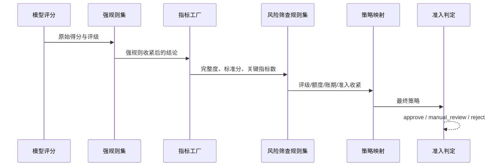

# 衡信客商信用风险与授信决策平台用户手册

> 适用版本：API `0.1.0`，数据库版本 `20260902_0072`
> 更新日期：2026-09-02
> 适用对象：客户经理、风控经理、模型管理员、授信审批人、运营人员、审计人员和平台管理员

## 1. 平台概览

平台用于统一管理客户与供应商的资料、信用评级、授信审批、模型治理、风险规则和贷后任务。核心决策能力分为三层：

1. **指标工厂**：定义数据口径、指标来源、派生表达式、评分分箱、模型选择和指标版本。
2. **规则中心**：定义强规则和风险筛查规则，组合规则集，并用决策管线编排评分、规则、筛查、策略和准入阶段。
3. **模型与决策治理**：管理模型变更、验证、审核发布、回滚、监控和审计证据。

平台采用双轨运行机制：配置了有效管线时优先执行规则中心；管线不存在、未激活或依赖不完整时，自动回退现有 v1 评分路径。回退不会留下半条执行结果。


### 1.1 当前工作台

React 业务前端提供八个工作台：

| 工作台 | 主要用途 | 典型角色 |
|---|---|---|
| 风险总览 | 查看组合风险、审批态势和授信敞口 | 风控、审批、管理人员 |
| 客商中心 | 查看客户/供应商画像、原始资料、治理数据和组合评级 | 客户经理、风控 |
| 授信审批 | 办理八阶段授信流程、授权会签和最终决策 | 客户经理、风控、审批人 |
| 模型实验室 | 查看评分链、指标、强规则、影响模拟和模型治理 | 模型管理员、风控、审核人 |
| 决策规则 | 配置规则、规则集和决策管线，执行规则测试与管线模拟 | 模型管理员、风控、审计 |
| 资料中心 | 上传、关联、预检、核验、退补和版本追踪 | 企业客户、客户经理、风控 |
| 运营监控 | 处理个人待办、团队任务、SLA 扫描、通知和催办 | 运营、风控、审计 |
| 贷后管理 | 管理额度、用信、复评、预警、续授信和控制条件 | 客户经理、风控、审批人 |

“决策规则”工作台按规则、规则集和决策管线分层展示资产。具备 `models:view` 的角色可以查看、测试和模拟；具备 `models:manage` 的模型管理员可以保存和提交治理草稿；具备 `models:review` 的风控经理或平台管理员可以独立复核、定时生效和运行到期扫描。创建人不能复核自己的变更。

### 1.2 角色与权限

关键权限遵循最小授权原则。演示环境可在页面右上角切换身份；生产环境应接入 OIDC，禁止使用开发令牌。

| 角色 | 主要职责 |
|---|---|
| 企业客户 | 上传和查看本企业资料、处理补件、查看本人申请与通知 |
| 客户经理 | 建立客商、发起审批、导入治理数据、办理业务资料和用信交易 |
| 风控经理 | 核验资料、运行评分、复核数据冲突、处理风险和模型审核 |
| 模型管理员 | 管理模型、配置候选版本、运行影响评估、管理规则中心发布 |
| 授信审批人 | 形成额度建议、执行授权会签、审核最终策略和控制条件延期 |
| 运营人员 | 监控 SLA、处理任务归属、催办、扫描异常和运行台账 |
| 审计人员 | 只读查看模型、决策、任务、授信和哈希审计证据 |
| 平台管理员 | 平台级管理和应急处置；不应代替正常四眼审核流程 |

## 2. 登录与启动

### 2.1 本地启动

在项目目录启动 API：

```bash
../.venv/bin/uvicorn backend.main:app --reload --port 8000
```

在另一个终端启动 React 前端：

```bash
cd frontend
npm install
npm run dev
```

常用地址：

- 业务前端：`http://127.0.0.1:5173/`
- OpenAPI：`http://127.0.0.1:8000/docs`
- 健康检查：`http://127.0.0.1:8000/api/v1/health`

### 2.2 演示身份

开发模式可使用 `Bearer dev-*` 令牌，例如模型管理员为 `dev-model-admin`、风控经理为 `dev-risk`、审计人员为 `dev-auditor`。开发令牌只能用于本地演示，生产环境必须配置 OIDC issuer、audience 和 JWKS URL。

## 3. 客商管理

### 3.1 查看客商

进入“客商中心”，按客户/供应商类型、模型和风险状态筛选。选择企业后可查看：

- 企业基本信息和当前评级；
- 申请额度、当前额度和风险标签；
- 原始企业档案及材料来源；
- 治理后的字段、冲突、时效性和评级准备度；
- 历史评级及组合批量评级结果。

### 3.2 导入企业数据

具备 `data_governance:import` 权限的人员可导入内部 ERP、工商、审计财务、外部风险、信用报告或企业提交数据。每批数据必须提供：

- 唯一导入键；
- 客商编号和数据来源；
- 数据时点；
- 证据引用；
- 字段载荷及可选的逐字段证据。

同一字段存在多个来源时，系统按来源优先级和时效性形成有效值。存在冲突、超期或缺失必需字段时，评级门禁会阻止自动决策或要求人工复核。

### 3.3 处理字段冲突

1. 打开客商的“数据治理”区域。
2. 查看冲突字段的各来源值、时点和证据。
3. 选择拟采用的字段记录并填写裁决原因。
4. 由具备复核权限且不同于创建人的人员审核。
5. 审核通过后，新有效值进入后续模型输入；原始记录继续保留。

不得直接修改数据库中的有效字段来绕过裁决流程。

## 4. 信用评级

### 4.1 单户评级

在客商中心或审批“形成评分”阶段选择模型并运行评分。系统依次完成：

1. 检查资料和治理数据是否满足评级门禁；
2. 冻结模型版本和输入快照；
3. 计算模型维度或子模型得分；
4. 执行强规则和企业风险筛查；
5. 形成评级、准入策略、额度、账期和监控频率；
6. 保存输入哈希、结果哈希和计算轨迹。

### 4.2 模型类型

| 模型 | 适用场景 | 主要输出 |
|---|---|---|
| 通用客商信用模型 | 一般客户与供应商 | 四维度得分、评级、额度和账期 |
| 材料增强型工商企业模型 | 财务及工商材料较完整的企业 | 分层子模型、业务财务矩阵、完整度和额度约束 |
| 科创企业基本评价模型 | 科创企业 | 基础分、加减分、额度分档和科创支撑项 |
| 行业派生模板 | 医药、制造、建筑、物流等 | 继承通用能力并覆盖行业配置 |

### 4.3 结果解读

评级结果应连同以下证据阅读，不能只看等级：

- `raw_rating`：规则和收紧前的模型评级；
- `rating`：最终评级；
- `dimension_scores`：维度或子模型得分；
- `strong_rule_hits`：命中的强规则及动作；
- `enterprise_risk_screening`：指标池完整度、标准分和逐指标结果；
- `risk_screening_policy`：风险筛查命中及收紧前后对比；
- `decision_pipeline_trace`：实际执行的管线版本和阶段证据；
- `review_required`：是否必须人工复核。

当管线依赖不足时，结果不会包含 `decision_pipeline_trace`，表示本次安全回退 v1。回退是兼容机制，不等于配置已完整上线。

### 4.4 组合批量评级

客商中心支持按客商范围和模型创建批量评级。批次会冻结模型快照，逐户保存结果或跳过原因，并汇总：

- 评级、风险分层和准入分布；
- 待复核、限制准入和禁入队列；
- 建议额度；
- 风险筛查收紧数量；
- 模型版本和结果哈希。

单批最多处理平台配置允许的样本量。批次结果用于风险排查，不自动替代授信审批。

## 5. 指标工厂

### 5.1 指标结构

指标分为三层：

- **原子指标**：通过 `field_path` 直接读取客商字段；
- **派生指标**：通过受限表达式计算，必须声明依赖；
- **复合指标**：组合多个原子或派生指标形成结果。

每个指标包含编码、名称、分类、数据类型、字段/表达式、依赖、评分分箱、最大分、默认权重、来源和版本信息。

当前企业风险指标池共 201 项、18 个分类：其中 185 项来自外部风险排查原始资料，16 项为平台补充的授信策略指标。新增策略指标覆盖财务承债能力、交易履约表现、信用敞口与回款；其阈值均为演示基线，正式使用前必须用机构历史样本校准并重新完成验证和治理发布。

### 5.2 表达式安全边界

表达式引擎仅允许数字、字符串、布尔、列表/元组、比较、布尔运算、基础算术和白名单函数。禁止属性访问、导入、下标、lambda 和任意函数调用。表达式失败时指标安全降级为待补充，不执行原始字符串代码。

可用函数包括 `abs`、`round`、`min`、`max`、`clamp`、`sum`、`len` 和 `contains`。

### 5.3 模型选择指标

指标发布只代表“可用”，不代表自动加入所有模型：

- 模型配置了 `indicator_selection` 时，仅计算明确选择且已激活的指标；
- 模型未显式选择但具有已知 `scorecard_type` 时，使用该模型的默认组合；
- 直接进行指标池验收且没有模型语境时，才允许计算全部激活指标；
- 任一必需定义缺失时，风险筛查回退 v1，不使用不完整的 v2 结果。

### 5.4 当前操作边界

主导航“指标配置”提供独立评分卡工作台。模型管理员可检索指标目录、选择固定指标版本、配置分箱/分数/可选 WOE、权重和总分刻度并保存治理草稿。风控复核人可查看配置证据和模型影响，填写复核结论后批准发布或驳回；提交人不能复核自己的变更。

评分卡发布不会自动替换模型配置。模型管理员需要在模型治理候选中选择已发布评分卡资产；平台固定资产 ID、编码、版本、配置哈希和完整配置，经候选比较、独立审核和发布后才切换生效模型。未绑定模型继续按自身 `indicator_selection` 和原评分链运行。

科创健康分占位定义保持未激活，只有公式、依赖、来源和分箱完成治理后才能发布。

### 5.5 评分卡依赖图与漂移门禁

“指标配置 -> 变更治理”会为每条评分卡候选展示完整依赖图，按指标、模型、管线、规则集、规则和发布包六层列出当前生效、历史快照和在途资产。模型节点会区分“直接绑定当前评分卡编码”和“仅使用相同指标”的间接影响，避免把所有共享指标模型误认为会自动切换评分卡。

依赖图同时展示结构化风险和发布后的必要动作。直接绑定模型、在途模型候选、在途规则资产、已进入发布包的依赖或缺失管线都需要复核。评分卡采用新版本后，模型仍固定原评分卡资产；必须另建模型候选，并重新完成评分卡开发验证和 Champion/Challenger 比较后才能切换。

提交复核时平台冻结排序后的依赖节点、关系及图哈希。待复核期间模型、管线、规则或发布包发生变化时，页面会显示“依赖已漂移”，并并列展示冻结哈希和当前哈希；批准按钮禁用，后端最终发布也会再次阻断。创建人应刷新影响范围、重新提交并由复核人按最新依赖审阅，不能沿用旧图继续批准。

### 5.6 评分卡分箱规则

- 数值指标使用连续区间，可用空下界/上界表示负无穷或正无穷；区间不得重叠；
- 离散和布尔指标使用枚举箱，同一个枚举值只能属于一个箱；
- 每个指标必须且只能有一个缺失箱，缺失不能被静默归入正常区间；
- 每个箱必须配置分数，WOE 为可选人工映射；没有训练样本时平台不会伪计算 WOE 或 IV；
- 权重必须大于 0。合计不等于 100% 时会提示发布后按比例归一；
- 连续区间分数非单调时会提示确认业务依据，重叠边界等结构错误会阻断提交；
- 草稿提交和最终发布都会重新计算校验结果，避免审核期间配置漂移。

页面中的问号按钮可通过悬停、键盘聚焦或点击查看功能说明。几个容易混淆的字段含义如下：

| 功能 | 主要用途 | 配置示例 |
|---|---|---|
| 连续区间 | 把金额、比例、次数等连续数值按上下边界切成不同风险组 | `0 至 10`、`10 至 30`、`30 至 +∞` |
| 离散枚举 | 把布尔值、等级、行业、状态等有限取值映射到不同风险组 | `正常,关注` 或 `制造业,商贸业` |
| 缺失箱 | 单独承接空值或未采集数据，避免缺失样本被默认当作正常 | `空值 / 无数据` |
| 标签 | 给分箱添加业务可读名称，不参与计算 | `正常`、`关注`、`异常` |
| 分数 | 样本命中分箱后获得的指标原始分，再结合权重形成总分 | 正常 `80`，异常 `20` |
| WOE | 衡量分箱对好坏样本的区分方向和强度，用于开发验证和统计解释 | 无可靠标签样本时留空 |

布尔指标使用离散枚举时，`false` 表示该条件不成立，`true` 表示该条件成立。它们是样本中的实际数据值，不是开启或关闭某项平台功能。例如“存在失信记录”的 `false` 可映射到“正常”箱，`true` 可映射到“异常”箱。

### 5.7 评分卡模型绑定与运行结果

模型治理页的“评分卡执行绑定”只列出已发布资产。选择后，候选草稿和后续模型快照会冻结评分卡完整配置，不跟随该评分卡的新版本自动更新。发布 v2 后，已经绑定 v1 的模型仍执行 v1；要切换版本必须重新编辑模型候选、运行 Champion/Challenger 比较并完成独立审核。

治理评分卡运行同时保留三种分数：

- `scorecard_raw_score`：各分箱分数按指标权重归一后的原始分；
- `scorecard_score`：映射到评分卡配置的业务刻度，例如 300-900；
- `total_score`：归一化到 0-100 的标准分，继续用于现有评级区间和策略映射。

模型实验室会展示评分卡编码/版本、业务刻度分、标准分、原始分、缺失指标数和配置哈希。评分解释记录每项指标实际值、命中分箱、权重、WOE、贡献和缺失状态。运行前会重新计算内嵌配置哈希；配置被改写、字段路径缺失或哈希不一致时直接阻断，不降级为旧评分结果。

### 5.8 有标签开发验证与 WOE/IV

“指标配置 -> 开发验证”复用决策规则工作台中已经固化的不可变样本快照。运行前需要选择已发布评分卡和快照，并配置：

- 事件标签，例如 `bad`、`default`、`reject`；
- 观察窗口开始/结束日期、表现窗口和标签成熟期；
- 最低有效样本、最低事件样本和最低非事件样本；
- 可选的结构化排除规则，包括字段路径、运算符、比较值和排除原因。

运行结果固定评分卡版本/哈希、快照 ID/哈希及全部标签口径，输出样本漏斗、三类样本门槛、逐指标 IV、连续箱事件率单调性，以及逐箱样本量、事件率、人工 WOE、样本计算 WOE 和 IV 贡献。样本计算采用 0.5 平滑以处理零事件箱，但只有事件和非事件两类都存在时才提供 WOE/IV；无标签、单一类别或样本不足会明确显示降级，不能解释为监督验证通过。

人工 WOE 属于评分卡配置，样本计算 WOE 属于开发验证证据。平台并列展示但不会自动覆盖；需要采用计算值时，应创建新的评分卡草稿，填写业务依据并重新走独立复核。

### 5.9 训练、验证和时间外检验

开发验证可以同时固定训练集、验证集和时间外（OOT）快照。训练集为必选，验证集与 OOT 可选；三者必须是不同的不可变快照。填写主体标识字段后，平台会检查每个快照内部是否重复，并检查同一主体是否跨集合出现。发现泄漏时运行直接失败，应修正样本拆分并导入新快照，不能通过删除证据或改写主体字段绕过。

三套集合分别展示有效样本、AUC 和 KS；验证集与 OOT 还会相对训练集计算 0-100 标准分的 PSI。若快照包含取值在 `[0,1]` 的预测事件概率字段，可填写该字段并生成 Brier、概率覆盖率和校准表。未配置概率字段时 Brier 和校准显示 `N/A`，平台不会把评分卡分数转换成伪概率。

运行记录固定评分卡版本/哈希、三套快照 ID/哈希、主体字段、标签口径和概率字段，并显示“主体泄漏检查通过”和证据完整性。AUC、KS、Brier 或 PSI 只是验证证据，不自动构成上线批准；正式门槛仍应按机构模型风险政策设置并由独立人员复核。

### 5.10 样本代表性与分群公平性

在开发验证中填写“分群字段”后，平台会分别对训练、验证和 OOT 样本按字段取值分组。多个字段使用英文逗号分隔。需要作为敏感属性审阅的字段还应填写到“敏感属性字段”，且必须同时出现在分群字段中。

每个字段展示属性覆盖率、缺失数、群体构成 PSI，以及各群体的样本占比、事件率、平均分、AUC、KS、FPR、FNR 和相对训练群体的分数 PSI。页面同时汇总达到最低群体样本数的群体之间最大事件率差、平均分差、AUC/KS 差和错误率差。低于门槛的群体会标记为小样本，不纳入最大差异结论。

FPR/FNR 依赖完整有效的预测事件概率字段和配置的分类阈值。任一群体概率覆盖不足时错误率显示 `N/A`。敏感属性全部缺失时覆盖率为 0，页面显示“属性缺失，不可测试”，不会把缺失解释为稳定或公平。该报告是模型风险诊断证据，不会直接改变客户评级、准入策略或授信结果。

### 5.11 机构验证门槛与独立复核

“开发验证”中的“机构验证门槛”用于把诊断指标转换为可审计的上线门禁。可配置是否必须提供验证集、OOT、概率和敏感属性证据，并设置 AUC、KS、Brier、整体分数 PSI、分群覆盖率、事件率差、平均分差、AUC/KS/FPR/FNR 差及逐群体分数 PSI 的阈值。运行后平台固化本次门槛，不随以后修改的默认值变化。

结果区同时展示全部检查和结构化超限项：全部必需检查通过时为 `PASS`，存在任一阻断项时为 `BLOCK`。不可测试指标根据“是否必需”形成阻断或警告；例如机构要求敏感属性证据但样本属性全部缺失时，不能把 `N/A` 视为通过。超限项会保留集合、字段、群体、实际值、比较方向和门槛，审核人无需根据页面文案反推失败原因。

每次新运行默认进入“待独立复核”。复核人必须具备 `models:review` 权限且不能是运行创建人，并填写不少于 5 个字的结论。`PASS` 运行可以批准或驳回；`BLOCK` 运行只能驳回并要求重新验证，不能通过普通审核绕过机构门槛。运行证据和审核决定分别保存可复算哈希，固定评分卡、快照、报告、门槛和审核状态；证据篡改、版本冲突或重复审核会被后端阻断。

### 5.12 验证证据图谱

开发验证记录提供三个可切换的证据视图，图表和原有明细表使用同一份固定报告：

- **分数分布**：按 0-100 十分位展示训练、验证和 OOT 的样本数及集合内占比。训练集是稳定性基准，验证/OOT 同时显示分数 PSI；超限状态来自本次机构门槛检查。
- **概率校准**：分别绘制三套集合的预测事件率和实际事件率，虚线表示完全校准，标题显示 Brier。只有固定快照中存在有效概率字段时才生成曲线。
- **分群漂移**：按字段和群体并列显示验证/OOT 相对训练集的分数 PSI。绿色表示对应门槛检查通过，红色表示超限，灰色表示不可测试；群体构成 PSI 是诊断值，不自动套用分数 PSI 门槛。

图谱用于快速定位异常，正式复核仍应结合结构化超限项、全部门槛检查和分群明细。图表没有重新计算或平滑报告数据；历史记录、证据哈希和审核哈希不会因为切换视图而改变。

### 5.13 验证策略模板与机构默认门槛

“指标配置 -> 验证策略”用于集中治理开发验证门槛。模型管理员可以创建策略草稿，设置适用评分卡范围、机构默认标记、四类必需证据和 11 项数值门槛；草稿可反复编辑，也可从已发布版本一键带入配置创建下一版本。提交后必须由不同的风控复核人填写结论并发布。

机构默认策略必须适用于全部评分卡，同一时点只有一个版本生效。发布新默认版本会停用旧版本，但旧版本和引用它的历史运行不会删除或改写。非默认策略可以限定一个或多个评分卡编码，只有 published、active、配置哈希有效且适用目标评分卡时才能被开发运行选择。

开发验证会自动选择当前机构默认策略，也可以显式选择适用策略。选择后页面将门槛显示为只读；后端固定策略 ID、版本、完整配置和哈希，并覆盖请求中更宽松的单次门槛。运行卡显示固定策略及完整性状态，后续策略升级不影响历史证据复算。只有尚未建立任何机构默认策略的存量环境，才继续兼容原来的单次门槛配置。

### 5.14 跨运行历史趋势

“指标配置 -> 开发验证 -> 趋势监控”按评分卡汇总历史固定运行。可以切换验证/OOT 的 AUC、KS、Brier、分数 PSI，以及最大群体 PSI、事件率差和平均分差。顶部指标展示运行次数、评分卡版本覆盖、最新门禁、历史通过率、最新值环比和完整性异常数。

趋势图中的实线是每次固定运行的实际值，虚线是该次运行实际使用的策略门槛。策略发布新版本后，后续点使用新门槛，旧点仍使用旧门槛，因此曲线可以同时审阅模型变化和政策变化。表格保留数据截面、评分卡版本、策略版本、门禁和复核状态，点击“查看证据”可回到完整运行卡。

证据哈希或策略完整性失败的运行会显示为异常，但不会把其中的指标画入趋势线。没有结构化门禁的历史报告标记为历史证据，也不计入门禁通过率。趋势用于持续诊断和定位，不会直接改变线上评分、评级、准入或授信结果。

### 5.15 持续验证计划与预警处置

“指标配置 -> 开发验证 -> 监控计划”用于把一次性开发验证转为持续运行。创建计划时选择固定评分卡版本、已发布验证策略、训练/验证/OOT 数据集、月度或季度频率、下次执行时间和责任人，并设置事件标签、分群字段等运行口径。计划绑定的是数据集；每次执行会选择计划截面之前该数据集最新的不可变快照，再将具体快照和哈希固化到新运行中。

模型管理员可以立即运行单个计划，也可以点击“扫描到期计划”批量处理已到期且启用的计划。计划台账显示固定评分卡、策略、三类数据选择、下次执行和最近状态。暂停计划只停止到期扫描，不删除计划、历史运行或预警。策略版本失效、数据集缺少可用快照或运行失败时，计划保留错误且不会把失败伪装为正常趋势。

生产周期任务通过 `python -m backend.jobs.scorecard_monitoring` 启动。人工扫描和后台任务使用同一套数据库租约与五分钟窗口幂等键，多实例争抢时只有租约持有者执行，其他实例安全跳过。页面“调度健康与失败恢复”显示到期积压、最早逾期时间、当前租约、最近后台心跳、死信数量和最近调度运行；运行台账固定每次尝试的来源、心跳、计划成功/失败数和执行前后积压。

调度运行可能为已完成、部分失败、失败或死信。普通失败可以受控重试；连续三次失败后进入死信，避免无限重试挤占执行队列。模型管理员核对并修复根因后可人工恢复死信，平台会创建新的运行并固定恢复人和来源，原死信记录不会删除或改写，同一死信也不能重复恢复。

运行后平台自动扫描机构门禁失败、连续三次性能或稳定性恶化、策略/证据完整性异常和调度失败。预警台账固定运行 ID、证据哈希、实际值、门槛和责任人，也可以回钻完整运行证据。严重预警的处置 SLA 为 24 小时，一般预警为 72 小时；进入总时限最后 25% 时标记临期，逾期后自动升级。创建、临期、逾期、升级、待复验和闭环完成均生成去重通知，并同步到运营中心的“模型验证”个人待办。

“指标配置 -> SLA 策略”用于治理上述时限。策略分别配置严重/一般预警的响应小时、临期比例和逾期升级窗口，也可限定评分卡编码及门禁失败、连续恶化、证据异常、策略异常或调度失败等预警类型。机构默认策略覆盖全部范围；更具体的范围策略优先匹配。策略必须经过创建人提交和独立复核人发布，配置哈希不一致或同优先级范围冲突会阻断使用。

预警创建时会固定命中的 SLA 策略版本、完整两级时限、适用范围、配置哈希和快照哈希。后续调整或发布 SLA 新版本只作用于新预警，不会重算历史预警的截止时间、临期比例或升级窗口。迁移生成的默认策略保持原有严重 24 小时、一般 72 小时、最后 25% 临期和逾期 4 小时升级口径。

预警必须依次经过确认、整改、提交复验和独立复验，处置人不能填写结果后直接关闭。提交复验时需要引用一个不同于原失败运行的新运行；该运行必须属于同一评分卡资产、使用计划固定的验证策略、证据完整且机构门禁为 `PASS`。具备复核权限且不是整改人的风控经理可以复验通过并关闭，或退回继续整改。关闭只表示新证据已由独立人员确认，原始 `PASS/BLOCK`、失败运行、历史指标和证据哈希始终保留，复验运行与复验证据哈希另行固定。

预警工具条可按处置状态、严重级别、预警类型、责任人、评分卡和实时 SLA 状态组合筛选。筛选结果数量、待闭环总量和选择数量分别展示，点击“清除筛选”恢复全部预警。CSV 导出严格复用当前筛选，文件包含固定评分卡、SLA 策略快照、指标门槛、运行和证据哈希，并带 UTF-8 BOM，便于直接在中文表格软件中打开。

常用组合可以保存为个人视图。填写视图名称并选择是否设为默认后保存；再次选择同一视图可更新其筛选。默认视图会在当前用户下次进入工作台时自动恢复，每位用户最多一个默认视图，其他用户看不到也不能修改。若要创建不同视图，先修改名称或从“全部预警”开始配置。

模型管理员可以勾选当前结果中的未关闭预警，或使用“全选当前未关闭结果”，填写批量责任人与至少五个字符的分派依据后统一分派。单批最多 100 条，平台会先校验全部事件的状态与行版本；任一预警已关闭、已被他人更新或不存在时，整个批次失败且不会部分写入。成功后每条事件和批次汇总均进入审计链。

### 5.16 评分卡组合稳定性

进入“指标配置 -> 开发验证 -> 组合稳定性”可从组合层面快速判断哪些评分卡需要优先处置。每张卡汇总最新与前次不可变验证运行，展示 AUC、KS、Brier、验证/OOT PSI、最大分群 PSI、环比、机构门禁、监控计划、开放预警和 SLA 状态。

组合状态按最严重证据确定：证据完整性异常为“证据异常”，机构门禁失败为“阻断”，没有启用监控计划为“未监控”，存在指标恶化或开放预警为“需关注”，其余为“健康”。页面支持状态筛选和评分卡编码/名称检索；“验证证据”回到完整固定运行，“预警台账”带入对应工作区继续分派和整改。

组合看板只聚合已经固化的证据，不在浏览器重新计算指标，也不会直接改变线上模型。无验证运行、无监督标签或不可测试指标会明确显示缺口，不能把空值解释为通过。

### 5.17 企业授信参数校准

进入“指标配置 -> 授信校准”，选择不可变回放快照后，可在当前企业信用模型基线上调整评级门槛、额度承载比例、账期比例和交易风险阈值。每个参数旁的问号说明其业务目的和调整方向；“恢复基线”会将全部候选参数恢复为当前模型值。

点击“运行基线 / 候选校准”后，服务端对相同样本顺序执行两套方案。结果并排展示自动准入、人工复核、拒绝、平均/总额度、平均账期、评级/准入迁移和各类分布，并固定展示 `-5/-2/0/+2/+5` 分评级门槛敏感性。带有事件和非事件标签时，还展示事件额度敞口占比和风险事件限制捕获率。

分析固定模型版本、快照内容哈希、基线配置哈希、候选配置哈希和证据哈希。无标签或标签只有单一类别时显示“非监督降级证据”，风险收益指标为 `N/A`；有效样本少于 100、字段覆盖低于 80% 或存在执行失败时显示明确警告。不得把降级、小样本或合成数据结果作为正式生产政策。

校准工作台不保存模型、不改变当前评级结果，也不直接发布。决定采纳候选参数后，仍需创建模型变更，固定校准依据，完成 Champion/Challenger 比较、机构门禁和独立复核后才能切换生产版本。

## 6. 规则中心

### 6.1 规则定义

一条规则包含：

- 唯一编码和名称；
- 类型：`strong_rule`、`risk_screening` 或 `admission`；
- 条件列表及 `all/any` 关系；
- 动作列表；
- 优先级、启用状态、版本和发布状态。

支持的主要动作：

| 动作 | 用途 |
|---|---|
| `rating_override` | 将评级收紧到指定等级 |
| `access_strategy` | 收紧准入策略 |
| `risk_segment_override` | 收紧风险分层 |
| `limit_multiplier_cap` | 设置额度比例上限 |
| `payment_term_days_cap` | 设置账期上限 |
| `review_required` | 强制人工复核 |
| `score_adjustment` | 仅允许负向分数调整 |
| `severity` | 设置风险严重程度 |

规则动作采用“只收紧、不放宽”原则。多条额度上限取最严格比例后应用一次，不连续相乘。

当前企业信用模型规则集包含 17 条强规则，覆盖资料完整度、逾期与额度使用、交付和发票匹配、关联方风险、历史坏账、重大诉讼、股权冻结、行政处罚、纳税信用及短合作期大额申请。规则中心种子合计 25 条规则、4 个规则集和 3 条管线。内部交易与应收类规则只有在资料完整标志为真时才使用业务阈值；资料缺失会进入人工复核和额度/账期收紧，不会把占位零值当成真实低履约。

### 6.2 规则集

规则集显式引用规则编码，可选择：

- `first_hit`：只应用第一条命中规则；
- `all_hits`：应用全部命中规则；
- `most_restrictive`：应用全部命中规则并合并为最严格结论。

规则集发布前会检查引用非空、不重复，并确认每条规则已发布且激活。悬空引用不会进入生效状态。

### 6.3 决策管线

管线必须以 `scoring` 开始，支持五类阶段：

1. `scoring`：执行模型评分；
2. `strong_rules`：执行强规则集；
3. `risk_screening`：计算指标工厂结果并执行筛查规则集；
4. `strategy_mapping`：把评级映射为额度、账期、准入和监控频率；
5. `admission`：形成 `approve`、`manual_review` 或 `reject`。

管线发布前会校验阶段类型、顺序、重复引用和规则集依赖。任一运行依赖不完整时整条管线返回空结果，由评分入口回退 v1。

### 6.4 通过前端操作

进入左侧“决策规则”工作台后，按以下顺序配置：

1. 先填写变更原因，再在“规则”页配置编码、类型、条件关系、表达式、比较方式、动作和优先级，选择“保存治理草稿”。
2. 在页面下方治理队列中编辑草稿并提交复核。提交后配置仍不会进入运行环境。
3. 切换到具备复核权限且不是草稿创建人的身份，填写复核意见，选择立即发布、安排未来生效时间或驳回。
4. 在“规则集”页选择已发布规则或有效候选规则和执行策略；在“决策管线”页从固定评分阶段开始编排，并为规则阶段关联已发布或有效候选规则集。候选依赖必须与引用方进入同一发布包。
5. 选择已发布规则可执行单规则测试；选择已发布管线可选取测试企业和评分模型执行全链路模拟。
6. 选择已有资产可查看版本历史。恢复历史版本只会创建新的治理草稿，仍需提交和独立复核，不会直接覆盖运行版本。

资产列表支持名称和编码检索。治理队列展示基础版本、候选版本、创建人、复核人、计划生效时间和行版本。只读角色的配置控件禁用，但规则测试与管线模拟仍可使用。

### 6.5 统一发布包

需要同时切换规则、规则集和管线时，在页面底部“统一发布包”区域操作：

1. 勾选状态为 `draft` 的候选变更，成员可跨规则、规则集和管线三个页签。
2. 填写发布包名称和变更原因，先选择“分析影响”。页面展示新建/更新数量、包内/运行依赖、下游规则集与管线及门禁错误。
3. 门禁通过后创建发布包。系统锁定成员候选版本，成员状态变为 `package_draft`，不能再单独提交或加入其他发布包。
4. 对涉及决策管线的发布包选择“配置回放”，指定模型、受影响管线、样本量和差异阈值，再运行历史样本回放。页面展示规则命中率、评分变化、评级/准入迁移矩阵、收紧/放宽数量和证据哈希。
5. 只有当前配置指纹对应的最新回放门禁通过后才能提交复核。成员随后进入 `package_pending_review`，另一位具备 `models:review` 权限的人员填写意见并批准或驳回。
6. 批准时系统固定按规则、规则集、管线顺序在一个数据库事务中发布；任一成员失败时整包回滚。驳回时成员恢复为普通草稿。

回放必须选择不可变数据集快照，默认样本上限 100、最低样本数 10、最大准入变化率 50%、最大执行失败率 0%。少于 30 户会标记为小样本证据。基线优先执行同编码运行管线；新管线没有运行基线时使用模型 v1 结果。提交和批准前都会重新检查配置指纹、数据集快照哈希、回放证据哈希、回放门禁、运行基线和依赖快照；环境、候选配置或快照内容变化时必须重新回放或重新创建发布包。

### 6.6 历史回放数据集

在“统一发布包”顶部选择“管理数据资产”：

1. 创建逻辑数据集，填写唯一编码、名称和业务口径说明。
2. 选择“导入快照”，指定数据源、模式版本、时间截面、数据分级和证据引用。
3. 原始字段与评分标准字段不一致时，在“字段映射 JSON”中按 `标准字段: 原始字段` 配置映射；已经符合平台客商结构时使用空对象 `{}`。
4. 在“样本记录 JSON”中提交对象数组，可选指定标签字段与观察时间字段。
5. 系统校验 `id/name/counterparty_type`、样本 ID 唯一性、敏感字段、观察时间不晚于快照截面，并生成字段覆盖率、标签覆盖率、标签分布和脱敏报告。
6. 每次成功导入生成递增版本和 SHA-256 内容哈希。快照没有修改或删除接口；修正数据必须导入新版本。

平台会阻断常见个人敏感字段和时间穿越样本。数据分级只能选择“已脱敏”或“合成数据”，但该声明不能代替机构的数据授权、脱敏评审和隐私合规流程。

### 6.7 Champion / Challenger 双模型验证

在历史回放数据集下方选择“配置并行验证”：

1. 选择同一个不可变快照，并分别选择 Champion 与 Challenger 模型、已发布决策管线。系统固化两侧模型版本、管线版本和快照哈希。
2. 配置分群字段、实际正类标签和预测正类准入状态。多个值使用英文逗号分隔，例如正类标签 `bad,default,reject`，预测正类准入 `reject,禁入`。
3. 设置 PSI、评级变化率、准入变化率、平均分绝对差、最大分群平均分绝对差和 Challenger KS 下降上限；按机构模型风险政策决定是否强制要求有标签证据。
4. 运行后查看结构化门禁结论和每个超限项的实际值、阈值及说明，同时查看两侧评分均值/中位数/范围、失败率、评分分箱、评级分布、准入分布、平均分差、评级/准入变化率和 PSI。
5. 页面按分群字段展示样本数、两侧平均分、平均差以及评级/准入变化率，用于识别局部客群漂移。
6. 快照存在标签时，系统基于有效标签样本计算两侧 KS 与 TP/FP/TN/FN 混淆矩阵；没有有效标签时，证据级别明确降为“非监督稳定性证据”，KS 和混淆矩阵留空。启用“必须提供标签证据”时，无标签会直接形成门禁违反项；未启用时仍保留明确警告。
7. 门禁失败后，模型管理员可填写原因、业务影响、补偿控制和最长 180 天的有效期申请例外。申请必须由另一名具备 `models:review` 权限的人员批准或驳回。
8. 例外批准只把处置状态改为“限期例外批准”，不会把原始 `gate.passed=false` 改写为通过。审计和后续发布必须同时引用原比较证据与例外记录。
9. 每次运行都会写入独立比较资产和 SHA-256 证据哈希。运行不修改快照、模型、管线或业务决策；快照内容哈希复算不一致时直接阻断。

PSI 衡量两侧评分分布差异，不等同于模型优劣结论。KS 与混淆矩阵还受标签窗口、正类定义、样本代表性和阈值口径影响，正式验证应由模型风险管理人员复核。

### 6.8 通过 API 操作

查看规则需要 `models:view`，创建和提交草稿需要 `models:manage`，复核与生效扫描需要 `models:review`。

创建并发布规则：

```bash
curl -X POST http://127.0.0.1:8000/api/v1/rule-center/rules \
  -H 'Authorization: Bearer dev-model-admin' \
  -H 'Content-Type: application/json' \
  -d '{
    "code": "SR-LIMIT-001",
    "name": "高额申请人工复核",
    "rule_type": "strong_rule",
    "category": "credit_risk",
    "conditions_json": [{
      "expression": "requested_limit > 1000000",
      "operator": "bool",
      "label": "申请额度超过100万元"
    }],
    "condition_relation": "all",
    "actions_json": [
      {"type": "access_strategy", "value": "人工复核"},
      {"type": "review_required", "value": true}
    ],
    "priority": 10
  }'
```

试跑规则不会产生发布版本：

```bash
curl -X POST http://127.0.0.1:8000/api/v1/rule-center/rules/SR-LIMIT-001/test \
  -H 'Authorization: Bearer dev-risk' \
  -H 'Content-Type: application/json' \
  -d '{"context":{"requested_limit":1500000}}'
```

创建规则集后才能创建引用它的管线。内置阶段不要发送空的 `rule_set_code`；只有需要规则集的阶段才填写该字段。

治理前端使用 `/rule-center/governance/changes` 创建、更新、提交和复核候选配置；`/governance/history` 查询版本历史，`/governance/restore-drafts` 创建恢复草稿，`/governance/activation-scan` 执行到期生效。

双模型比较使用 `/rule-center/governance/replay-comparisons` 创建和查询证据。门禁失败后，通过 `/{comparison_id}/exceptions` 查询或提交例外；`/{comparison_id}/exceptions/{exception_id}/review` 仅允许具备 `models:review` 权限且不是申请人的人员复核。

### 6.9 发布与治理边界

规则中心前端默认使用四眼治理。候选状态包括 `draft`、`pending_review`、`rejected`、`scheduled`、`published` 和 `activation_failed`。批准发布时系统在同一事务中：

1. 停用同编码旧版本；
2. 激活新版本；
3. 写入隔离的治理变更记录；
4. 写入包含配置哈希的审计事件。

为兼容种子脚本和旧调用方，`POST /rules`、`POST /rule-sets` 和 `POST /pipelines` 仍保留直接发布语义，但治理工作台不会调用这些接口。生产集成应优先使用治理 API，并限制直接发布接口的调用主体。未来生效的候选在基线版本变化时不会强行覆盖，而会进入 `activation_failed`，要求基于最新版本重新创建草稿。同一资产最多存在一个 `scheduled` 候选。

截至本手册更新时，真实 `data/platform.db` 的规则、规则集和管线表为空，尚未执行默认规则中心种子。三个模板虽然配置了默认管线编码，但会安全回退 v1。

## 7. 模型治理

### 7.1 模型变更流程

模型管理员在模型实验室创建候选变更，配置权重、阈值、强规则、策略映射、指标选择、已发布评分卡绑定和风险筛查策略。标准流程为：

```text
创建草稿 -> 编辑配置 -> 验证与影响评估 -> 提交审核 -> 独立审核 -> 发布
```

创建人不能审核自己的候选版本。样本覆盖、计算完整性、标签量或验证门槛未满足时，候选版本不能提交发布。

模型候选还必须完成专属 Champion/Challenger 比较，不能引用另一个已发布模型的比较结果冒充候选验证。在“Champion / Challenger 发布证据”区选择不可变快照、两侧管线、机构阈值和 1 至 180 天证据有效期，然后在对应草稿上运行候选比较。系统自动固定：

- Champion 为变更单的 `base_version`；
- Challenger 为同一变更单的 `candidate_version` 和候选配置哈希；
- 数据快照 ID/哈希、两侧管线编码/版本、比较证据哈希和绑定哈希；
- 原始比较门禁、当前处置状态、证据级别、有效期、例外和独立复核人。

编辑草稿会立即清空旧绑定。提交审核与最终批准都会重新复算快照、比较证据、候选配置和绑定哈希，并检查基线/候选版本、有效期及门禁或有效例外；任一项漂移、篡改或过期都必须重新运行。

变更卡中的“固定评分卡”区展示候选实际执行的评分卡编码、版本、指标/分箱数、业务刻度和完整配置哈希。显示“沿用现有评分逻辑”表示该候选没有启用治理评分卡运行时。切换或解除评分卡绑定同样属于候选配置编辑，已有比较证据会立即失效。

绑定评分卡的模型候选还必须选择一条匹配的已批准开发验证运行。该运行必须属于同一评分卡资产、版本和配置哈希，报告版本为 v4，机构门禁为 `PASS`，并已由非创建人独立批准。变更卡会展示训练/验证/OOT 快照、监督或降级证据级别、证据哈希和审核哈希。提交审核和最终发布都会重新复算这些内容；评分卡已发布本身不能替代开发验证证据。

### 7.2 影响评估

发布前应检查：

- 评级迁移和高风险召回变化；
- 额度、账期和准入策略变化；
- 强规则命中变化；
- 指标数据完整度和风险筛查变化；
- 组合样本覆盖和计算失败样本；
- 变更是否放宽风险结论。

### 7.3 比较证据与发布决策

变更卡会同时显示“原始比较门禁”和“当前处置状态”。门禁通过时处置状态为“可发布”；门禁失败但有效例外已经独立批准时，处置状态为“限期例外有效”，原始门禁仍显示失败。没有有效证据、例外待复核、证据失效或过期时，提交和发布入口保持禁用，后端也会再次拒绝请求。

无标签快照允许按机构策略降级为非监督稳定性证据，但页面明确标记，不能把空的 KS 或混淆矩阵解释为模型性能通过。机构要求监督证据时，应在比较阈值中启用“必须提供标签证据”。

两侧模型业务刻度不同时，比较证据会保留原始分和业务刻度分，但 PSI、KS、平均分差及分群稳定性统一按各模型固定口径转换后的 0-100 标准分计算。治理评分卡运行时已经提供 `normalized_score` 时直接使用该值，避免对标准分重复归一化。

运行并绑定候选证据使用 `POST /model-governance/changes/{change_id}/comparison-evidence/run`，需要 `models:manage` 权限和当前变更单行版本。

### 7.4 发布与回滚

审核通过后形成激活 release。回滚只能选择已有 release，并填写原因。发布和回滚均保留模型配置哈希、操作者、时间和审计记录。在途审批冻结模型和输入版本，不因后续发布而改变。

### 7.5 模型监控

模型治理支持真实结果导入、独立核验、周期监控、问题整改和复验。正式回溯需要满足最低样本、时间跨度和事件/非事件数量；未达到门槛时代理数据只能作为演示证据。

## 8. 授信审批

### 8.1 八阶段流程

| 阶段 | 主办角色 | 完成条件 |
|---|---|---|
| 客户注册 | 客户经理 | 主体信息完整 |
| 上传资料 | 企业客户/客户经理 | 资料上传并关联申请 |
| 补充资料 | 企业客户/客户经理 | 指定缺口和退补任务关闭 |
| 发起审批 | 客户经理 | 业务类型、额度和账期完整 |
| 选择模型 | 风控/模型管理员 | 模型、数据和版本门禁通过 |
| 形成评分 | 风控/模型管理员 | 可信评分及哈希保存 |
| 额度与授信期 | 授信审批人 | 建议额度、账期和授权层级形成 |
| 最终策略 | 有权审批人 | 会签完成并保存最终决定 |

页面会显示当前责任角色、完成条件和阻断原因。已完成、拒绝或撤回的申请不会继续进入待办。

### 8.2 资料四眼核验

上传人不能完成自己的独立核验。核验按完整性、主体匹配、有效期、关键页和可读性逐项检查。要求补充时生成退补任务，替换版本保留 V1/V2/V3 链路。只有核验通过的资料才能推动审批。

### 8.3 授权会签

最终策略根据额度和风险匹配标准、加强或委员会授权层级。会签按席位顺序进行，同一人员不能占用多个独立席位。偏离模型建议必须登记原因，风险放宽还必须给出补偿措施。

## 9. 风险筛查与准入判定

风险筛查位于模型评分之后，只允许保持或收紧模型结论。



重点字段：

- `completeness`：已取得指标占比；
- `normalized_score`：指标池归一化分；
- `critical_indicator_count`：已取得且处于关键低分区间的指标数；
- `missing_count`：缺失指标数。

筛查结果不能提高评级、增加额度、延长账期、放宽准入或取消已有人工复核要求。

## 10. 贷后与运营

### 10.1 贷后管理

授信审批完成后形成授信台账。具备权限的人员可：

- 登记额度占用和归还；
- 发起复评和续授信；
- 登记风险事件；
- 处理高使用率、到期、复评和风险预警；
- 创建冻结、降额或关闭等控制动作；
- 完成续授信控制条件或申请延期。

风险动作必须填写业务依据。存在未归还余额时不能关闭授信；续授信申请额度不能低于当前已用余额。

### 10.2 运营监控

运营中心统一展示个人待办、团队任务、SLA 风险、补件任务和通知。任务认领使用限时租约，过期后自动释放。人工催办有频率限制，延期有次数和总时长限制。

SLA 扫描使用全局租约防止多实例重复执行，并记录运行键、心跳、处理数量、失败和恢复证据。异常释放或重试必须填写原因。

## 11. 核心 API 参考

所有业务 API 使用前缀 `/api/v1`，并要求 Bearer token。完整请求和响应模型以 `/docs` 为准。

| 业务域 | 关键端点 | 权限示例 |
|---|---|---|
| 身份 | `GET /auth/me` | 已登录 |
| 客商 | `GET /counterparties` | `counterparties:view` |
| 评级 | `POST /ratings/run`、`POST /ratings/trace` | `ratings:run` |
| 批量评级 | `POST /ratings/batches`、`GET /ratings/batches/{id}` | `ratings:run/view` |
| 模型 | `GET /models`、`POST /models/impact` | `models:view`、`ratings:run` |
| 模型治理 | `/model-governance/changes`、`/releases`、`/validation` | `models:manage/review/view` |
| 指标池 | `GET /indicator-pool` | `models:view` |
| 指标配置与评分卡 | `/indicator-center/catalog`、`/scorecards`、`/scorecard-changes`、`/validation-policies`、`/scorecard-development-runs`、`/scorecard-development-trends`、`/credit-calibration/config`、`/credit-calibration/analyze` | `models:view/manage/review` |
| 指标观察值 | `/indicator-observations` | `indicator_data:view/manage/review` |
| 规则 | `/rule-center/rules` | `models:view/manage` |
| 规则集 | `/rule-center/rule-sets` | `models:view/manage` |
| 管线 | `/rule-center/pipelines` | `models:view/manage` |
| 审批 | `/approval-cases` | `approvals:create/view/act` |
| 资料 | `/documents` | `documents:upload/view/review` |
| 数据治理 | `/data-governance` | `data_governance:*` |
| 授信台账 | `/credit-facilities` | `facilities:*` |
| 信用报告 | `/credit-reports` | `reports:view/generate` |
| 运营任务 | `/operations` | `operations:view`、`tasks:manage`、`sla:scan` |
| 审计 | `/audit` | `audit:view` |

常见 HTTP 状态：

| 状态 | 含义 | 处理方式 |
|---|---|---|
| `200/201` | 查询或创建成功 | 检查响应中的版本和状态 |
| `401` | 缺少或无效令牌 | 重新登录或更新 Bearer token |
| `403` | 当前角色无权限 | 切换有权角色，不要绕过权限 |
| `404` | 资源不存在 | 核对编码、ID 和激活状态 |
| `409` | 并发或版本冲突 | 刷新数据后重新提交 |
| `422` | 输入或依赖校验失败 | 根据 `detail` 修正字段、阶段或引用 |

## 12. 审计与数据安全

模型、指标、规则、规则集、管线、审批、资料和关键运营动作均保留操作者和时间。治理发布事件使用 SHA-256 内容哈希并串联前序哈希，支持发现内容篡改和链路断裂。

操作要求：

- 不直接修改生产数据库中的治理表；
- 不共享管理员或审批人账号；
- 不用开发令牌连接生产环境；
- 不删除历史版本、审计事件或证据文件；
- 不在缺少证据时人工填充“正常”数据；
- 发生并发冲突时刷新后重做，不覆盖其他人员变更；
- 对模型放宽、授信偏差和异常释放填写真实业务依据。

## 13. 常见问题

### 13.1 模板已绑定管线，为什么结果仍走 v1？

管线编码存在不代表依赖完整。检查管线是否已发布激活、规则集和规则是否齐备、指标工厂是否包含模型所需指标。任一条件不满足都会安全回退。

### 13.2 为什么通过旧 API 创建规则后直接是 published？

`POST /rules`、`POST /rule-sets` 和 `POST /pipelines` 是为种子脚本和旧调用方保留的兼容接口。前端治理工作台会先创建 `draft`，提交后进入 `pending_review`，只有独立复核通过才会发布或进入 `scheduled`。

### 13.3 为什么发布一个指标后其他模型没有变化？

指标发布和模型绑定是两个动作。模型只计算显式选择或其默认组合中的指标，不会自动吸收全部激活指标。

### 13.4 为什么风险筛查只能降低结果？

风险筛查是贷策收紧层，用于在模型评分后处理外部风险、数据缺口和关键指标异常。它不能用于奖励性加分或放宽授信。

### 13.5 为什么提示依赖未发布？

单资产发布要求规则集引用已发布激活的规则、管线引用已发布激活的规则集。需要同时发布候选依赖时，把完整的“规则 -> 规则集 -> 管线”依赖闭包纳入同一发布包；遗漏候选依赖会被发布门禁阻断。

### 13.6 为什么管线阶段拒绝空规则集编码？

内置阶段不需要规则集时应省略 `rule_set_code` 字段，不要发送空字符串或 `null`。需要规则集的阶段必须填写有效编码。

### 13.7 为什么评级被要求人工复核？

常见原因包括资料完整度不足、强规则命中、风险筛查命中、模型自身评级要求、内部交易数据缺失或授权策略升级。查看 `strong_rule_hits`、`risk_screening_policy.hits` 和管线 trace 定位原因。

### 13.8 如何确认实际执行的是哪个版本？

查看模型版本、评级运行记录、输入/结果哈希及 `decision_pipeline_trace.pipeline_version`。没有管线 trace 时说明本次走 v1。

### 13.9 可以直接执行种子脚本吗？

先运行 `python scripts/seed_rule_center.py --dry-run`。不带 `--dry-run` 会写入当前 `DATABASE_URL` 指向的数据库。执行前必须确认环境、revision、编码冲突和授权，不要在未知数据库上试运行。

### 13.10 真实演示库当前是否已有默认规则中心数据？

没有。截至 2026-08-26，只读核对显示规则、规则集和管线表均为空，默认种子尚未获授权写入；评分会继续安全回退 v1。

### 13.11 为什么发布包不能提交复核？

涉及决策管线的发布包必须先完成历史样本回放。确认最新回放的配置指纹与发布包一致、证据哈希可复算、执行失败率和准入变化率没有超过设置阈值，且有效样本数达到最低要求。候选配置或依赖发生变化后，旧回放自动失效，需要重新运行。

### 13.12 回放通过是否代表可以直接生产上线？

不代表。回放通过只说明选定快照在当前阈值下通过执行与差异门禁。正式上线前仍需确认数据授权、脱敏质量、时间截面、标签口径、样本代表性、分群覆盖和机构阈值；合成或小样本快照不能代替生产验证。

### 13.13 为什么不能覆盖已有数据集快照？

快照是发布证据的一部分，覆盖后会破坏历史审批可复算性。发现字段映射或样本错误时，应修正源数据后导入下一版本；发布包必须重新选择新快照并再次回放。

### 13.14 门禁失败后批准例外，为什么页面仍显示 BLOCK？

这是预期行为。例外审批不能改写已固化的比较事实，只能在限定有效期和补偿控制下改变处置状态。页面会同时显示原门禁失败、超限项和“限期例外批准”；审计、发布判断和后续监控都必须保留两套证据。

### 13.15 为什么旧的双模型比较证据要求重新运行？

迁移 `0060` 之前生成的比较资产没有阈值门禁配置和结构化超限项，不能事后推定为通过，也不能直接申请例外。平台会将其标记为历史证据并要求使用当前阈值重新运行。

### 13.16 为什么规则中心比较已经通过，模型草稿仍不能提交？

模型变更单只接受直接执行该草稿候选配置生成的专属证据。证据必须绑定当前变更 ID、基线版本、候选版本、候选配置哈希和不可变快照；普通模型对模型比较不能替代候选验证。编辑草稿、证据到期、快照或比较结果被篡改、基线漂移后，都要在模型治理页重新运行并绑定。

### 13.17 为什么评分卡发布了新版本，模型评分没有自动变化？

这是版本治理的预期行为。模型绑定的是某个已发布评分卡资产的固定版本和完整配置，不是“始终取最新版本”的动态编码。请在模型治理页编辑候选并选择新评分卡版本，重新完成影响评估、Champion/Challenger 比较和独立发布。这样历史评级、模型快照和审批证据才能复算。

### 13.18 为什么开发验证显示无标签或样本降级？

先检查快照是否配置了 `label_field` 和 `observed_at_field`，事件标签是否与快照实际值一致，以及样本是否因观察窗口、成熟期或排除规则被过滤。有效样本、事件或非事件任一数量低于设置门槛都会降级。平台不会通过平滑项或人工 WOE 补造缺失的监督证据。

### 13.19 为什么三集合验证被主体泄漏阻断？

训练、验证和 OOT 应代表相互独立的样本集合。同一主体在多个集合出现会让验证指标虚高，因此平台默认按 `id` 检查，并在缺失、集合内重复或跨集合重复时阻断。请在源数据侧按主体重新拆分并导入新快照；只有确有不同主体标识口径时才调整“主体标识字段”。

### 13.20 为什么敏感属性显示不可测试？

常见原因是快照没有该字段、字段全部为空，或经过观察窗口、成熟期和排除规则过滤后没有有效值。平台不会根据企业名称、地区或其他字段推断缺失的敏感属性。应先确认数据收集具有合法目的、授权和适当保护，再导入新快照；不能为了让报告显示通过而人工补造属性。

### 13.21 为什么验证门禁失败后不能批准？

独立复核用于确认固定证据和机构门槛得到正确执行，不是普通例外审批。`BLOCK` 表示至少一项被配置为必需的检查失败或不可测试，批准会让机构门槛失去约束力，因此前端禁用批准且后端再次校验。复核人应填写原因并驳回，开发人员修正样本、字段、模型或验证方案后创建新的运行；原失败记录和证据哈希继续保留。需要建立例外机制时，应另行设计带有效期、补偿控制和更高权限的治理流程，不能直接改写本次门禁结论。

### 13.22 为什么图谱与表格显示的指标相同？

这是证据一致性的设计要求。图谱负责快速比较形态和定位异常，表格负责展示精确值和完整口径；两者都读取同一份固定验证报告，不会在浏览器中重新计算 PSI、Brier 或群体差异。若图表标记与结构化门禁不一致，应视为展示缺陷并停止审批，不能选择对业务更有利的一种解释。

### 13.23 为什么评分卡已经发布，模型候选仍不能提交？

评分卡发布只证明配置资产经过发布治理，不等于它已经用固定训练、验证和 OOT 样本满足机构验证门槛。绑定评分卡的模型候选必须同时具备两类有效证据：同一评分卡版本的 v4 开发验证为 `PASS` 且已独立批准，以及直接执行当前候选配置生成的 Champion/Challenger 比较通过或具有有效例外。任一证据缺失、过期、哈希不一致或版本漂移都会保持提交入口禁用。

### 13.24 为什么待复核评分卡突然不能批准？

提交评分卡时平台会冻结当时的完整依赖图。待复核期间只要关联模型、快照、管线、规则集、规则或发布包发生变化，当前图哈希就会与冻结哈希不同，页面显示“依赖已漂移”并禁用批准。这不是配置校验失败，而是复核范围已经变化；应由创建人重新提交最新影响图，再由独立复核人确认直接绑定、在途冲突和发布后模型重新验证要求。

### 13.25 为什么单次开发运行不能修改验证门槛？

当前机构已发布默认验证策略后，门槛属于独立治理资产，不属于某一次开发运行的可编辑参数。平台由服务端解析并固定策略版本，即使请求中携带更宽松的门槛也不会采用。需要调整标准时，应在“验证策略”中基于当前已发布版本创建新版本，说明变更原因并重新完成四眼发布；新版本只作用于后续运行，不会改写历史结论。

### 13.26 为什么趋势中有运行记录但没有指标点？

先查看该行是否标记“完整性异常”或“历史证据”。证据哈希、快照、评分卡或验证策略无法复算时，平台保留异常记录用于审计，但不会展示可能已被改写的指标；旧报告没有对应指标或结构化门禁时也会保持空值。应回到运行证据核对原因并重新生成新的固定运行，不能手工补写历史曲线。

### 13.27 为什么监控计划没有选择数据集最新版本？

平台只选择计划执行截面之前已经存在的不可变快照，不会使用未来截面，也不会跨到其他数据集。先确认计划绑定的数据集编码、快照 `as_of_date`、计划时区和下次执行时间。最新快照内容哈希失败、数据集停用或策略版本失效时，运行会失败并生成预警，不会回退到无法说明原因的其他资产。修正后应导入新快照或更新计划，再重新执行；不要覆盖旧快照。

### 13.28 为什么填写整改结果后不能直接关闭预警？

整改说明只能证明已经采取行动，不能证明异常已经消除。平台要求先生成同一评分卡、同一固定验证策略下的新 `PASS` 运行，再由不同于整改人的风控复核人员独立确认。复验通过后预警才会关闭；复验失败会退回整改。这样可以同时保留原失败证据和复验成功证据，避免处置人自证闭环或通过改写历史结果消除预警。

### 13.29 为什么到期扫描显示被安全跳过？

这通常表示另一个实例已经持有有效数据库租约，或当前五分钟调度窗口已经生成过运行。安全跳过用于避免同一批计划被重复执行，不是任务失败。先查看“调度健康与失败恢复”中的租约持有者、租约到期时间、后台心跳和最近运行键；只有租约长期不释放且心跳过期时，才按运行手册检查后台进程和数据库时间。

### 13.30 为什么调度运行进入死信？

同一运行连续三次失败后会进入死信，平台停止自动重试以保护队列。应先从运行台账查看错误分类和失败计划，修复数据快照、策略状态、证据完整性或基础设施问题，再由模型管理员执行人工恢复。恢复会创建新的尝试并保留原死信、恢复人和新运行引用；重复点击同一死信不会创建多条恢复运行。

### 13.31 为什么修改 SLA 策略后旧预警的截止时间没有变化？

这是不可变治理证据的预期行为。预警开户时已经固定当时命中的 SLA 策略版本、两级时限、临期比例、升级窗口和快照哈希；后续新版本不能回写历史事件。新策略只作用于发布后新创建且匹配其适用范围的预警。若旧预警确需延期，应走单独的授权延期流程并保留理由，不能通过修改策略批量改写历史截止时间。

### 13.32 为什么批量分派一条都没有成功？

批量分派采用“全有或全无”事务。只要所选事件中有一条已关闭、被其他用户更新、行版本过期或已经不存在，平台就阻断整个批次，避免责任人台账部分变更。刷新列表、移除不可分派事件后重新提交；原批次失败不会留下半套分派记录。

### 13.33 为什么进入预警台账后只看到部分事件？

当前用户可能设置了默认个人视图，平台进入工作台时会自动恢复其筛选。查看工具条中的个人视图和筛选字段，点击“清除筛选”即可恢复全部预警。保存视图只影响当前用户的展示和导出口径，不会删除、关闭或修改事件。

### 13.34 为什么企业新增财务或交易指标显示缺失中性分？

先检查 `data_quality.internal_transaction_complete`。该标志未明确为真时，平台不会把应收逾期率、额度使用率、交付达成率或财务比率中的 `0` 当作真实业务值，而是按缺失中性分计入完整度，并由资料缺失规则触发人工复核和收紧。资料完成核验后再写入真实指标值并重新运行，不能仅修改完整标志来绕过证据要求。

### 13.35 组合稳定性显示“未监控”或“证据异常”怎么办？

“未监控”表示该评分卡没有启用持续验证计划，应在监控计划中固定评分卡、策略、三类数据集、频率、时区和责任人。“证据异常”表示最新运行的评分卡、快照、策略或证据哈希无法复算，应回钻验证证据定位资产漂移或内容异常并生成新运行；不能通过手工修改组合状态消除提示。

## 14. 上线检查清单

在启用规则中心管线前逐项确认：

- 数据库 revision 为唯一 head `20260902_0072`；
- 规则、规则集和管线均为 published、active 且单活跃；
- 规则集引用无空值、无重复且全部存在；
- 管线以 scoring 开始，阶段类型和规则集引用有效；
- 模型所需指标均已发布激活并完成绑定；
- 企业指标池 201 项的来源与版本可追溯，16 项授信策略指标已经使用机构样本校准；演示基线没有直接作为生产阈值；
- 企业信用 17 条强规则已经完成字段覆盖、缺失降级、边界样本和只收紧验证，内部交易完整标志与真实资料证据一致；
- 评级、授信、额度和账期结果同时保留原始结论、最终结论、命中规则与计算上限；额度五类上限取最小值，账期矩阵和预付款策略符合机构授权政策；
- 授信校准使用同一不可变快照成对比较基线与候选，模型/快照/候选配置/证据哈希均可复算；评级、准入、额度、账期、迁移和敏感性结果已复核，无标签或小样本证据没有被误作生产结论；
- 评分卡连续区间无重叠、离散枚举无重复、缺失箱唯一，指标版本和配置哈希已固定；
- 评分卡提交人与复核人分离，已发布新版本没有绕过模型治理自动切换生产模型；
- 评分卡依赖图覆盖指标、模型、管线、规则集、规则和发布包；冻结图哈希与当前图哈希一致，不存在未处置的依赖漂移；
- 直接绑定和在途模型已明确后续候选计划，采用新评分卡版本前会重新完成开发验证与 Champion/Challenger 比较；
- 评分卡开发验证已固定训练样本快照、标签定义、观察窗口、成熟期、排除规则和样本门槛；人工 WOE 与样本计算 WOE 没有混用；
- 评分卡训练、验证和 OOT 快照互不重复，主体跨集合泄漏检查通过；AUC、KS、Brier、概率覆盖率、校准和 PSI 的可测试状态及口径已经复核；
- 分群字段具有明确业务或模型风险用途，最低群体样本门槛合理；敏感属性的数据授权、覆盖率、不可测试状态和群体差异已由适当人员复核；
- 开发验证已经固定机构门槛，全部必需检查为 `PASS`，不存在被静默视为通过的不可测试指标或未处置超限项；
- 机构默认验证策略为 published、active 且适用于全部评分卡；策略配置哈希可复算，同一时点不存在多个生效默认版本；
- 每条开发验证固定策略 ID、版本、适用范围、完整门槛快照和哈希；单次运行不能放宽策略门槛，历史运行没有被后续策略版本改写；
- 跨运行趋势中的评分卡版本、策略版本、数据截面、实际指标和逐次门槛均可追溯；完整性异常和历史证据没有被计入正常曲线或门禁通过率；
- 组合稳定性看板能够识别证据异常、门禁阻断、未监控、指标恶化和开放预警，并能回钻不可变验证证据与对应预警台账；
- 每个持续验证计划固定评分卡、策略、训练/验证/OOT 数据集、运行口径、频率、时区和责任人；到期扫描只使用执行截面之前的最新不可变快照；
- 持续验证后台进程正常运行，数据库租约、五分钟幂等键和心跳有效；多实例扫描不会重复执行，到期积压和最早逾期时间处于可接受范围；
- 调度失败按受控次数重试，连续三次失败进入死信；人工恢复能固定原运行、恢复人和新运行引用，同一死信不能重复恢复；
- 门禁失败、连续恶化、策略/证据完整性异常和调度失败均进入预警台账；运行、证据哈希、实际值、门槛、分派和处置记录可追溯，原始验证事实没有被后续动作改写；
- 预警 SLA、临期、逾期和升级状态正确，创建/临期/逾期/升级/待复验/闭环通知按节点去重，并能从运营待办直达对应事件；
- 当前默认 SLA 策略为 published、active 且覆盖全部评分卡与预警类型；范围策略不存在同优先级冲突，严重/一般响应时限、临期比例和升级窗口已经独立复核；
- 每条新预警固定 SLA 策略 ID、版本、完整配置和快照哈希；策略升级不会改写历史预警截止时间或升级口径，存量事件迁移快照可复算；
- 预警组合筛选与 CSV 导出口径一致，中文 CSV 可直接打开；保存视图按用户隔离且每人最多一个默认视图；
- 批量分派最多 100 条，只允许未关闭预警，行版本漂移或无效事件会阻断整个事务；批次和单条事件审计均可追溯；
- 整改结果引用同一评分卡资产、同一固定策略且机构门禁为 `PASS` 的新运行，没有复用原失败运行或缺少完整性证据；
- 整改人与独立复验人分离，复验通过才可关闭，复验失败能退回整改；原失败运行和原证据哈希始终保留，复验运行和复验证据哈希可复算；
- 验证运行创建人与复核人分离，批准状态、复核意见、证据哈希和审核哈希均可复算；门禁失败记录只允许驳回重做；
- 每个绑定评分卡的模型候选均引用同一资产、版本和配置哈希的 v4 开发验证；该运行门禁为 `PASS`、独立复核为已批准，训练/验证/OOT 快照和双哈希可复算；
- 评分分布、概率校准和分群漂移图谱与结构化门禁及明细表一致，超限集合、字段和群体能够直接定位；
- 规则试跑和管线模拟结果符合预期；
- v1 回退结果已回归验证；
- 管理、审核、审批和审计权限已分离；
- 创建人不能复核自己的变更，同一资产不存在多个待生效候选；
- 关联候选依赖已完整纳入同一发布包，配置指纹、基线和依赖快照门禁通过；
- 受影响管线已使用经授权的历史样本完成回放，样本快照、模型/管线版本、阈值、命中率、迁移矩阵和证据哈希可追溯；
- 数据集快照脱敏检查与时间穿越检查通过，必填字段和样本 ID 唯一性通过，字段/标签覆盖率符合机构要求；
- 回放有效样本数达到机构门槛，执行失败率与准入变化率未超阈值，小样本开发证据未被误作生产验证；
- Champion/Challenger 的 PSI、评级/准入变化、平均分差、分群分差和 KS 下降均有明确机构阈值；旧比较证据已按当前阈值重新运行；
- 两侧评分业务刻度不一致时，原始分、业务刻度分和 0-100 标准分均可追溯，PSI、KS、分差和分群稳定性使用标准分且没有重复归一化；
- 所有限期例外均记录原因、业务影响、补偿控制、有效期和独立复核人，且没有把原门禁失败改写为通过；
- 每个模型变更单均绑定直接执行其候选配置生成的比较证据，Champion/Challenger 版本、候选配置哈希、快照哈希、证据有效期和绑定哈希可复算；
- 启用治理评分卡的模型已固定评分卡资产、编码、版本、完整配置及配置哈希，运行结果能追溯业务刻度分、标准分、分箱和缺失证据；
- 模型提交与最终批准均重新校验评分卡开发验证和候选比较两类证据，草稿修改、证据过期、内容篡改或基线/资产漂移均能阻断；
- 发布包故障注入已确认任一成员失败时整包回滚；
- 定时生效扫描和 `activation_failed` 异常处置已纳入运行手册；
- 变更单、配置哈希和审计事件可查询；
- 生产环境关闭开发认证并配置 OIDC；
- 全站正文使用系统中文字体优先栈，代码证据使用等宽字体并保留中文回退；所有可见 UI 文本不低于 11px，桌面、平板和手机断点没有页面级横向溢出；
- 已制定回滚、异常处置和监控方案。
